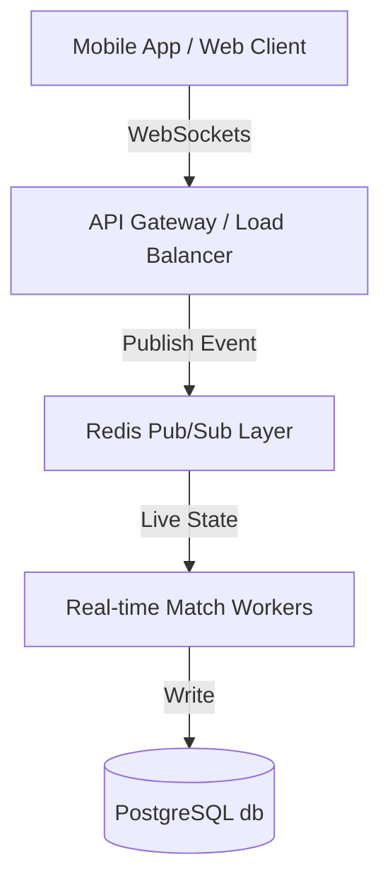

# Product Requirements Document (PRD)

## 1. Executive Summary & Strategic Goals
The goal of this initiative is to design and implement **365 FanZone**, a live social engagement layer for the 365Scores mobile app. FanZone allows fans watching the same live match to join instant chat rooms, cast votes in live sentiment polls, and participate in micro-predictions.
* **Target Metric**: Increase Daily Active User (DAU) average session duration by 150%.
* **Secondary Metric**: Boost 30-day user retention rates by 12% through gamification and social connection.

## 2. User Stories & Acceptance Criteria
* **US-1: Live Chat Participation**
  * *As a* Fanatic Frank,
  * *I want to* participate in a live chat stream with other supporters during a match,
  * *So that* I can share real-time reactions and banter.
  * **Acceptance Criteria**:
    * Chat updates in real-time under the "FanZone" tab with less than 200ms latency.
    * Users can view messages, send text messages, and use customized sports emojis.
    * Includes badging indicating team allegiance.
* **US-2: Micro-Predictions**
  * *As an* Analytical Brandon,
  * *I want to* predict live micro-events (e.g., next goal scorer, next card) during play,
  * *So that* I can test my knowledge and earn leaderboards points.
  * **Acceptance Criteria**:
    * Alerts/Polls slide up as modals when triggered by a match moderator or automatic event trigger.
    * Predictions lock within 10 seconds of creation or upon match events.
    * Correct predictions instantly credit the user with XP (Experience Points).

## 3. Detailed Feature Specifications & Design Layouts

### Feature A: Match FanZone tab
* **Layout**: Rendered alongside Info, Lineups, and Stats.
* **Sub-components**: Live Sentiment Meter showing crowd prediction percentages (e.g., Real Madrid 55% vs Barcelona 45%) and a scrollable chat thread.

### Feature B: Live Prediction Modals
* **Trigger**: Automated alerts based on game events (e.g., a penalty awarded triggers a popup: "Will he score?").
* **UX Flow**: A bottom sheet modal slides up, displaying options (Yes/No), XP reward, and a countdown timer.

### Feature C: FanZone Leaderboard
* **Metrics**: Users earn XP for votes, chats, and successful predictions.
* **UX Flow**: Renders top 3 users with gold/silver/bronze badges, user's current rank, and progress bar to next level.

## 4. Technical Architecture & Performance Specifications

* **Protocol**: WebSockets for low-latency chat transmission and server-sent events for live match score updates.
* **Data Layer**: Redis for high-frequency chat buffers and PostgreSQL for user XP balances and leaderboards.
* **Scaling**: Support up to 100,000 concurrent active users per major match room.

## 5. Product Analytics & Instrumentation Plan
To measure feature success, the following events must be logged:

| Event Name | Trigger Event | Parameters Captured | Key Success Target |
| :--- | :--- | :--- | :--- |
| `fanzone_joined` | User clicks the FanZone match tab | `match_id`, `user_id`, `allegiance` | 40% of match viewers join |
| `poll_voted` | User submits a prediction or sentiment vote | `poll_id`, `match_id`, `vote_option` | Average 3 votes per user |
| `xp_gained` | User receives XP for a correct prediction | `amount`, `source`, `new_balance` | 80% user engagement with XP systems |
